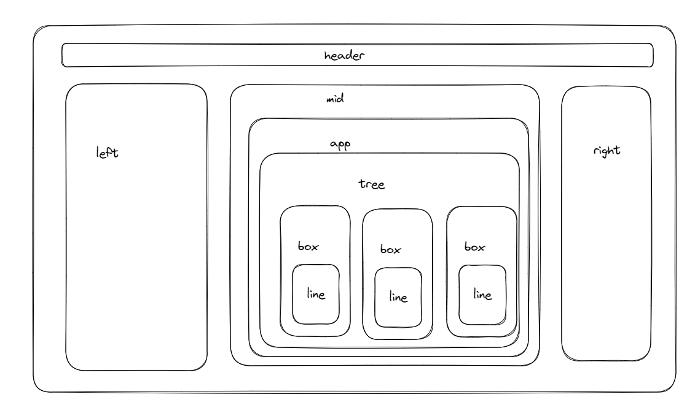

# 不做简历

## 前言
本项目是基于[毛豆花生](https://blog.csdn.net/weixin_40507529?type=blog)的[果子米-开源海报设计器](https://github.com/LvHuaiSheng/gzm-design)所二开出来的项目，本项目仅专注于简历方向，做且仅做简历相关的需求与场景，如果您的需求是设计海报/PPT等，请移步上方的**开源海报设计器**。

## 项目介绍
此项目针对于对word并不熟练的同学，有以下场景：
1. 写简历的时候从网上搜索出来的模板带水印
2. 模板多次收费的
3. 免费的简历难以搜索，下载的时候还需要网盘会员，不然会很慢等。

基于此，本项目作者开发了此开源项目，仅用于通过拖拽的方式生成自己的简历图片，然后保存成图片发给hr；建议您平常开发时养成随手记录您的产出，以便在使用此项目时将元素拖拽好位置后粘贴内容即可。

## 技术栈
[vite](https://cn.vitejs.dev/) + [leafer](https://www.leaferjs.com/)，无后端。

### vite
一种新型前端构建工具，能够显著提升前端开发体验。它主要由两部分组成：
- 一个开发服务器，它基于 原生 ES 模块 提供了 丰富的内建功能，如速度快到惊人的 模块热更新（HMR）。
- 一套构建指令，它使用 Rollup 打包你的代码，并且它是预配置的，可输出用于生产环境的高度优化过的静态资源。

Vite 是一种具有明确建议的工具，具备合理的默认设置。Vite 还提供了强大的扩展性，可通过其 插件 API 和 JavaScript API 进行扩展，并提供完整的类型支持。具体教程请单击上文链接，本文档不做赘述。

### leafer
绚丽多彩的 HTML5 Canvas 2D 图形渲染引擎，Leafer UI 致力于实现一套简洁、开放、现代化的 UI 绘图语言标准，表现力丰富，并提供跨平台、轻量化、高性能的运行时。

让不同的软件之间能够沟通、协作、共享绘图数据，让数字化产品开发可以更快、更简单。

通过不断革新的图形渲染技术、配套支持， 吸引更多的开发者加入使用，建立起一个开放的生态环境，沟通有无，互相从中受益，推动行业的快速发展，并诞生出更多有创意的技术和产品。

如您想学习leafer，除了上文链接之外，也可以斧正[此文章](https://shuangxunian.github.io/2023/12/16/23121600/)以作研究。

## 页面架构

### 目录架构

## 鸣谢
- [leafer](https://www.leaferjs.com/)
- [果子米-开源海报设计器](https://github.com/LvHuaiSheng/gzm-design)

## 开源协议
遵循[MIT协议](https://github.com/shuangxunian/no-resume/blob/main/LICENSE)

